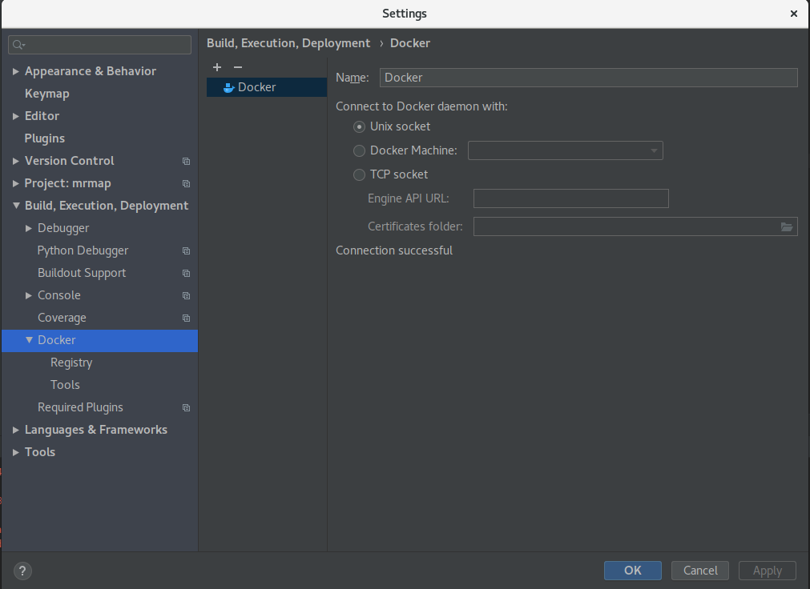
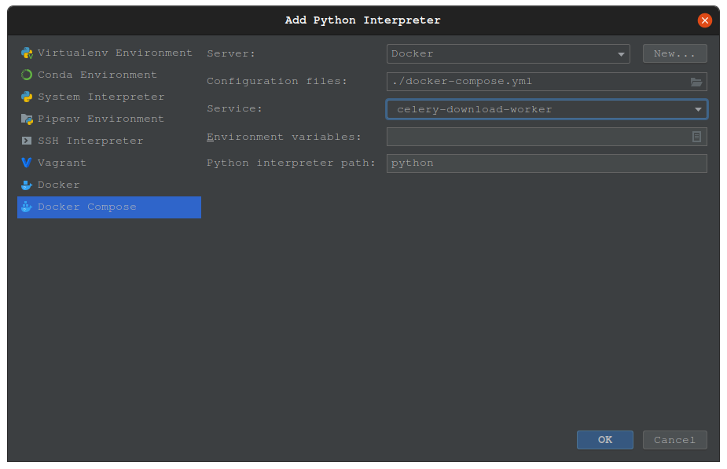
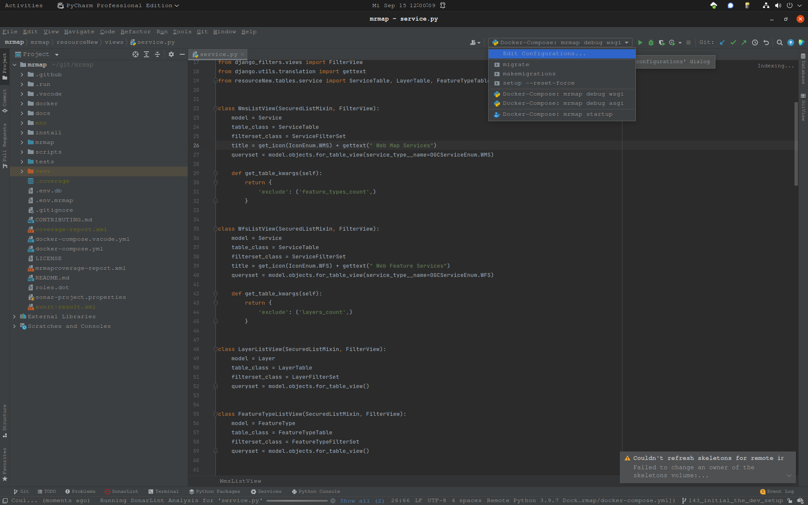
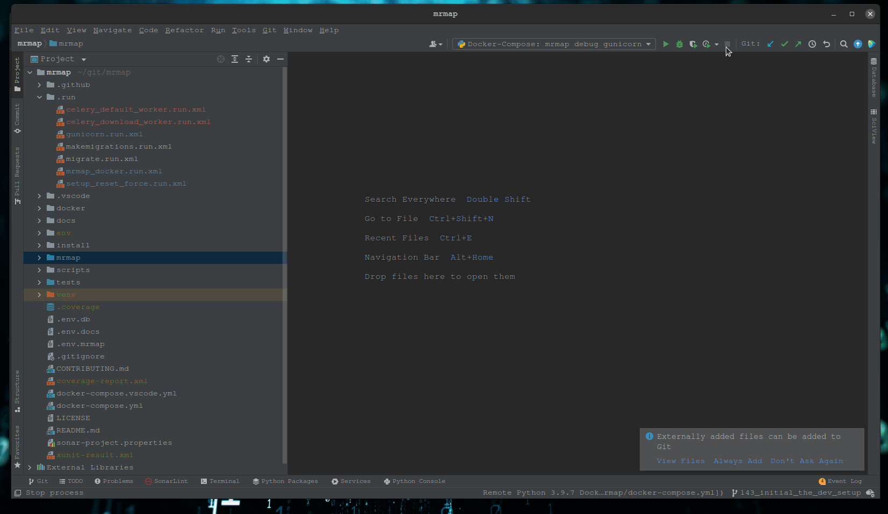

.. _development-pycharm-cfg:

=====================
Pycharm configuration
=====================

.. warning::
    Debugging dockerized projects in pycharm needs a pycharm professional version.

1. Configuration of Pycharm and Docker
**************************************

* Open Pycharm and point it to the root directory of mrmap, eg. `/opt/mrmap/`
* Goto File->Settings->Plugins and search for docker to install it.
* Goto File->Settings->Build,Execution,Development->Docker
* Click on the plus sign to add a docker configuation.
* Use the default settings and click on apply, it should say "Connection successful".

2. Configure project structure
******************************

Next we have to mark the mrmap folder as source folder.

* Right click on the mrmap folder in the pycharm directory tree, eg. /opt/mrmap/mrap
  and select "Mark Directory as -> Source Folder"

3. Add remote interpreter
*************************

Add one remote interpreter per container you want to debug. 

4. Runconfigurations
********************

We provide a set of default run configurations for pycharm. Pycharm should find that configurations automatically. See example image below.

Finally you have to change the remote interpreter to the specific remote interpreter of the docker service which the command runs in to. For example add the remote interpreter for service ``gunicorn`` to the run configuration ``Docker-Compose: mrmap debug gunicorn``.

Example
*******
See full example of how to start debugging below.

