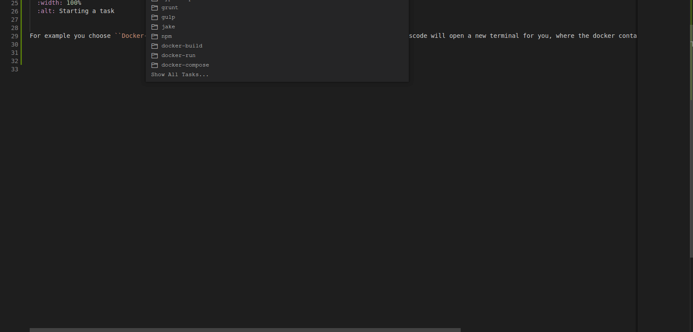
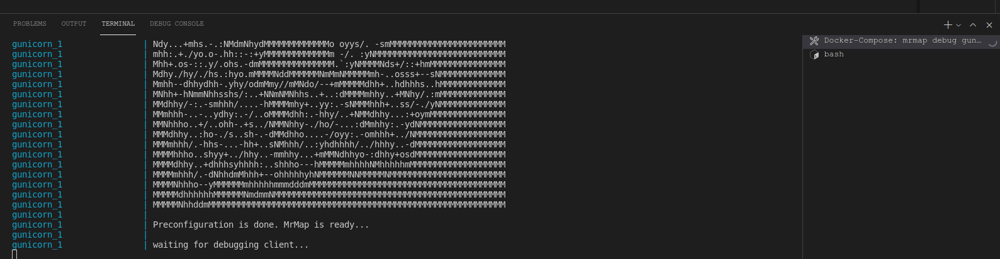
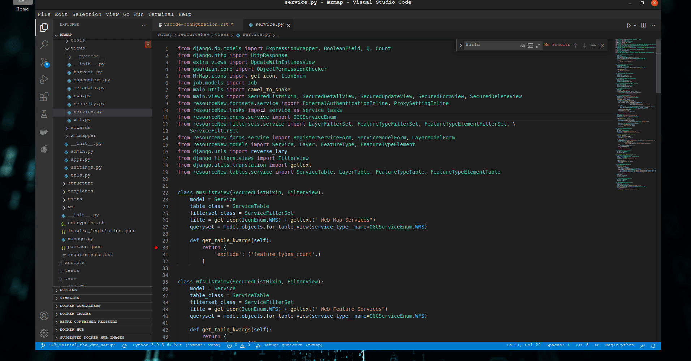

.. _development-vscode-cfg:

================================
Visual Studio Code configuration
================================

All necessary run configurations to starting development are provided with the repository. 
The configuration file is located under ``{local-path-to-repo}/.vscode/tasks.json``.

1. Open repo in vscode
======================

Go to ``File -> Open Folder...`` and select the root folder of the downloaded repo.

2. Start container in debugging mode
====================================

Currently there are three containers which executes MrMap application logic. For all of those containers one run configuration is provided.

Use the vscode shortcut ``ctrl + shift + p`` to use the `Command Palette`.
Start typing ``tasks: r``. QuickOpen will show you possible results for your search. Select ``Tasks: Run Task`` and smash the enter button. In second autoselect listing you can now choice one of our pre configured run configurations.

.. figure:: ../images/development/vscode/start_task.gif
  :width: 100%
  :alt: Starting a task

  Starting a task

For example you choose ``Docker-Compose: mrmap debug gunicorn`` and smash the the enter button again, vscode will open a new terminal for you, where the docker container is running.

  Gunicorn container run example

3. Connect with debugger to the container
=========================================

The container will show you at least ``waiting for debugging client``. Now you have to connect to the container with the integrated debugger of vscode. Again there are ready to use run configurations located under ``{local-path-to-repo}/.vscode/launch.json``.

Again you can start debugger by using the `Command Palette`. So use shortcut ``ctrl + shift + p`` again and start typing ``>debug: sel``

.. figure:: ../images/development/vscode/gunicorn_container_debugger_connect.gif
  :width: 100%
  :alt: Gunicorn container debugger connect example

  Gunicorn container debugger connect example
    
Visual studio code will now attach to the remote container. You will see that the container finaly start gunicorn service.

  Gunicorn container debugger connect successfully example

Now you are able to debug code in vscode. See full example video below.

  Full example of starting container and connect with debugger
